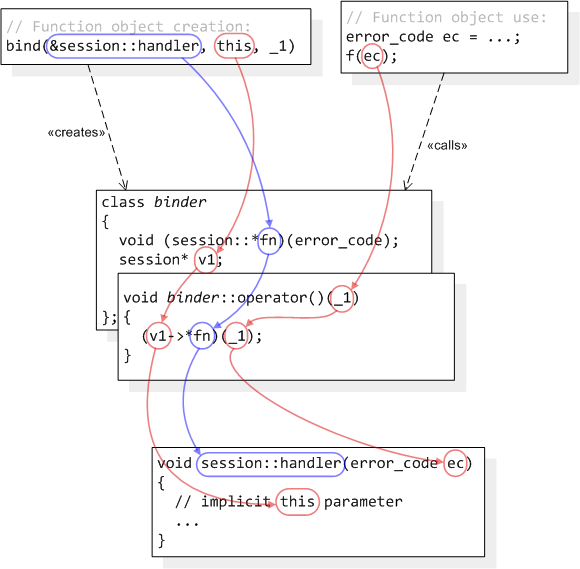
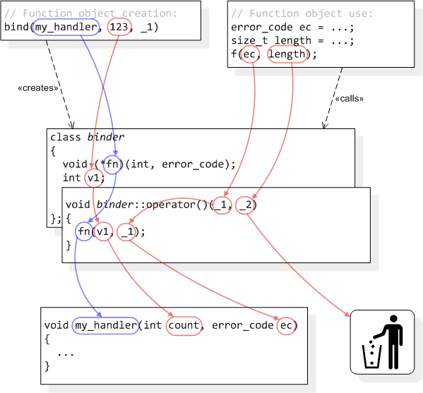

C++STL std::bind实现原理与源码分析
==================================

std::bind采用统一的语法来创建函数对象，以及对于使用该库的类型只有很少的要求。
这种设计使得无需关注如何去写与你的类型一起工作的代码，而只需关注我们最关心的一点，代码如何工作以及它实际上做了什么。

std::bind创建函数对象来绑定到一个函数(普通函数或成员函数)。不需要直接给出函数的所有参数，参数可以稍后给，
这意味着绑定器可以用于创建一个改变了它所绑定到的函数的 arity (参数数量) 的函数对象，或者按照你喜欢的顺序重排参数。

函数 bind 的重载版本的返回类型是未指定的，即不能保证返回的函数对象的特征是怎样的。有时，你需要将对象存于某处，
而不是直接把它传送给另一个函数，这时，你要使用std::function, 另外一篇博客中介绍过。弄明白 bind 函数返回的是什么的关键在于，
理解它发生了什么转换。

### std::bind实现原理

下面，我们引用[Thinking Asynchronously in C++: Bind illustrated](http://blog.think-async.com/2010/04/bind-illustrated.html)，通过具体的例子，介绍std::bind使用和参数转换的原理。

1、bind函数（包装器/适配器）能够将用户提供的需要一个参数的函数调整为不需要参数的函数对象。需要的时候，绑定的值（这个例子中是123）存储在函数对象中，自动地传递给用户指定的函数。
```cpp
f = bind(my_handler, 123)
```

一个匿名类（即这里的binder类）的成员变量捕获了函数指针的值和绑定的参数的值，匿名类重载了operator（）运算符，从而其对象为仿函数/函数对象。在operator函数体内，使用捕获的函数指针和参数，回调函数指针指向的函数。匿名类只会捕获提前绑定的参数。
当用户调用该函数对象时，实现延迟调用。


2、绑定一个参数也可以将类的成员函数调整为不需要参数的函数对象。正如你所知，非静态的成员函数都有一个隐式的this指针参数。这就意味着在函数指针内部需要绑定一个指向该类的一个对象的指针：
```cpp
f = bind(&session::handler, this)
```

匿名类捕获一个指向session的对象的指针作为其成员变量的值。


3、或者，隐式的this指针可以通过给函数对象传入一个显示的参数：
```cpp
f = bind(&session::handler, _1)
```


4、函数对象通常同时使用提前绑定的参数和调用时提供的参数。这个过程可以通过给成员函数绑定参数来实现：
```cpp
f = bind(&session::handler, this, _1)
```

这里的_1是std::placeholders命名空间里的占位符，在调用函数对象的时候，参数按对应的顺序传递给占位符。


5、当然也可以使用非成员函数：
```cpp
f = bind(my_handler, 123, _1, _2)
```


6、有的时候，函数对象调用时会提供一些不会被目标函数使用到的参数，bind（) 函数会自动的忽略这些多余的参数：
```cpp
f = bind(my_handler, 123, _1)
```


7、多余的参数不需要在函数签名的最后边：
```cpp
f = bind(my_handler, 123, _2)
```

也就是说，提前绑定的参数会使调用时又提供的参数无效而丢弃。


8、bind() 函数允许改变参数的顺序让目标函数能够适应函数对象的函数签名：
```cpp
f = bind(my_handler, _2, 123, _1)
```


从上边的图中可以看出，bind() 函数的原理和lambda函数的原理是类似的，都是通过捕获变量来生成一个匿名的类，在类中重载operator() ，从而其对象是能够调用的函数对象/仿函数。


#### 参考文献：

- [C++11 bind函数实现原理图](https://blog.csdn.net/zhouguoqionghai/article/details/45770523)


